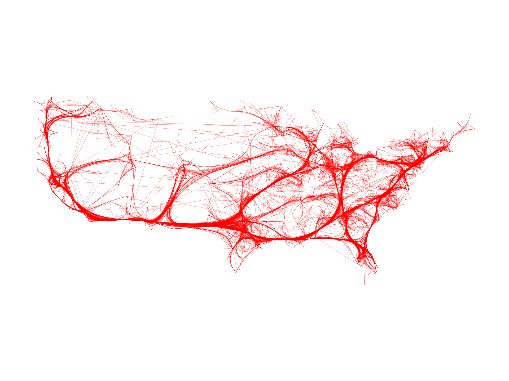
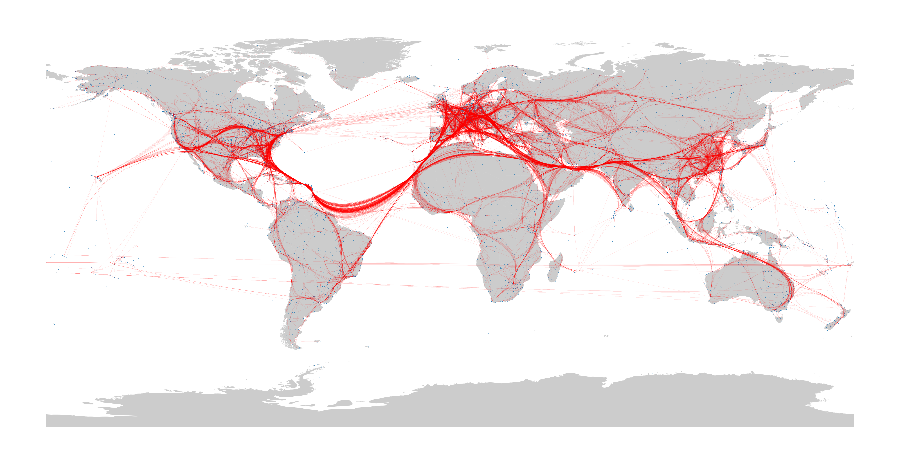
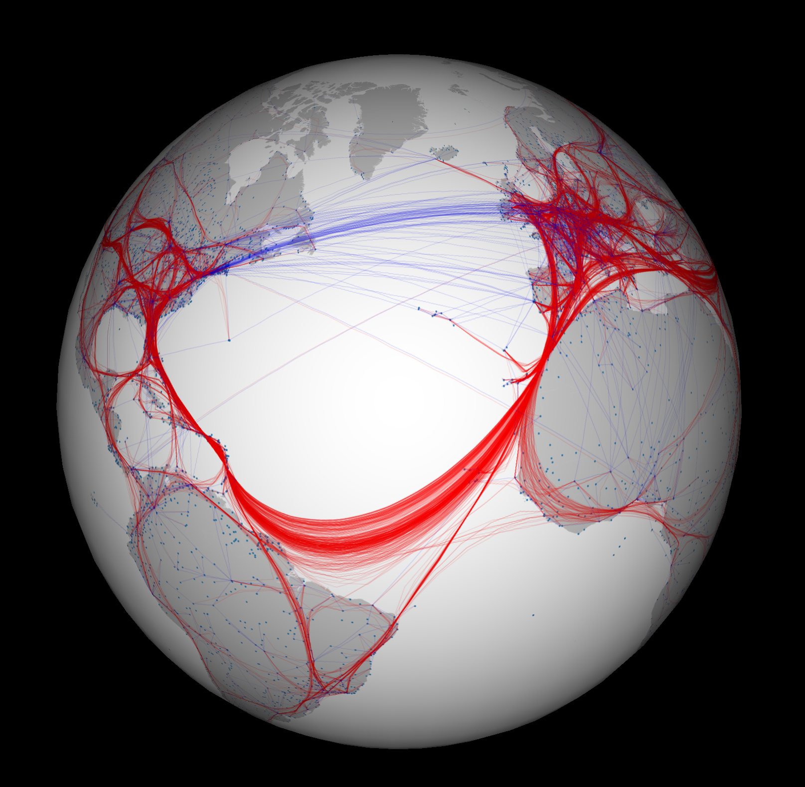

# Edge-Path Bundling: A Less Ambiguous Edge Bundling Approach

## Introduction

The goal of this project is to implement a paper by Markus Wallinger [Edge-Path Bundling: A Less Ambiguous Edge Bundling Approach](https://arxiv.org/abs/2108.05467). This paper presents a novel approach for edge bundling in graphs. In comparison with other papers on the same topic, 
this algorithm does not create new edges and always bundles edges along an existing path. This results in a unique feature - this algorithm does not force the user to believe there is an underlying structure in the data when in reality there is none.

The implementation was tested using 2 datasets. The first dataset called Migrations is directly taken from the authors ([source](https://github.com/mwallinger-tu/edge-path-bundling/blob/master/data/migrations.json)) to compare this implementation with one of the authors. The second dataset used for benchmarking 
is a collection of airports and flights between them. Its two parts were taken from the Kaggle site ([airports](https://www.kaggle.com/datasets/open-flights/airports-train-stations-and-ferry-terminals), [flights](https://www.kaggle.com/datasets/open-flights/flight-route-database)). The datasets contain a total 
of 12,100 airports and 59,036 flights between them. After preprocessing (removing NULL values, airports without any flight to/from, and flights to airports not present in the dataset) 
we were left with 10,669 airports (nodes) and 19.080 flights (edges).

The source code with the demo is available in [this repository](https://github.com/xpeterk1/edge-path-bundling).

## Visualization

Nodes in both of the datasets should represent a position on a globe with longitude and latitude. However, the Migrations dataset's nodes do not have the correct scaling and therefore should be understood more as nodes in 2D space than a positions on a world sphere. For this reason, we do not render the 
resulting graph with an underlying world map for orientation. This is, however, not the case with the second dataset of airports and flights. The dataset contains the correct longitude and latitude for all airports and therefore can be drawn with the underlying map. As proposed by the authors, Beziér curves were used. 
Furthermore, as mentioned in the paper, smoothing was also employed.

In the 2D renderings, all lines are drawn using red colour. This is not the case with the spherical projection, where only bundled curves are drawn in red. Edges that were not bundled and are therefore the original edges from the graph are drawn in blue.

## Implementation

The majority of code is implemented using Python with NumPy, matplotlib, pandas, and numba for optimization. The spherical plotting is implemented in C++ using OpenGL 4.6 with the library Cinder.

## Required packages

NumPy, matplotlib, Pandas, Geopandas, numba, tqdm

## User Guide

This section describes how to run the code and import your dataset. To run the program, run the `main.py` file.

### Data loading

The algorithm expects two collections - `nodes` and `edges`. 

- `edges` is a Python list of class `Edge`. To create the `Edge`, one needs to specify 4 parameters: ID of the source node, ID of the destination node, distance, and weighted distance. The constructor only takes the IDs of source and destination nodes,
so distance and weight must be imported by hand.

- `nodes` is a Python dictionary mapping node IDs to class `Node`. Each `Node` class takes 4 parameters: ID, longitude, latitude, and name. Furthermore, each node has a collection of edges that go from/to the node.

An example of data loading is in `airports.get_airports_data` and `migrations.get_migrations_data`.

### Algorithm

The algorithm itself can be controlled using two parameters `k` and `d`. Both of them can be set in the `main.py` file. 

- `k`: if the found path for bundling is longer than `k` times the length of the original edge, this edge is not bundled (default is `k = 2`).
- `d`: controls the weight of the edge. The weight is computed as $edge.distance^d$ (default is `d = 2`).

### Plotting

2D plotting plots the result in a 2D texture. A total of 4 parameters control the drawing:
- `use_map`: If True, draws an underlying map. Recommended for data that have precise longitude and latitude. Default True.
- `plot_3d`: If True, plots curves with spherical projection for display on a sphere. Default False.
- `n`: Number of sampling points for Beziér curves. Default 100.
- `smoothing`: Level of recursive smoothing. Default 2.

# Demo

#### Airlines dataset, 2D

#### Migrations dataset, 2D

#### Different values for `d` parameter

##### `d = 1.0`

##### `d = 1.5`

##### `d = 2.0`

#### Airlines dataset, 2D vs. 3D plotting

**2D Plotting**             |  **3D Plotting** |
:-------------------------:|:-------------------------:|
  |   | 

#### Airlines dataset, plotted on a sphere

